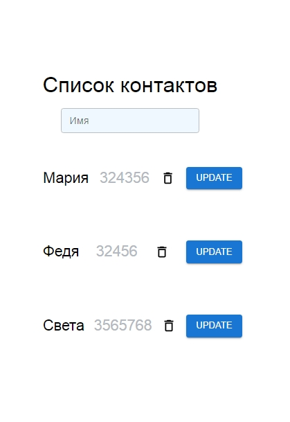

# Тестовый проект
#### Этот проект, сделан Омельченко Ольгой

## Функционал
* Авторизация
* Добавление и удаление контактов
* Редактирование контактов
* Поиск контактов по имени

___
## Для запуска проекта вам необходимо набрать команду в терминале:

**npm i**

#### После набрать команду:

**npm run dev**
#### ввести любие данные в форму

___

### Технологии проекта
#### React 
#### RTK Query Overview 
#### React-Router 
#### React Hook Form 
#### Material UI
___

### Установил следующие библиотеки в зависимости:
* material ui
* react-redux
* react-router-dom
* redux-toolkit
* json server
* concurrently
* react-hook-form
  
___
### Для выполнения поставленных задач я использовал следующие библиотеки:
* redux, redux-toolkit - чтобы создавать асинхронные экшены
* react-router-dom - для роутинга
* json-server - для REST API
* material ui - для использования готовых компонентов
* react-hook-form - для использования готовых компонетов форм
